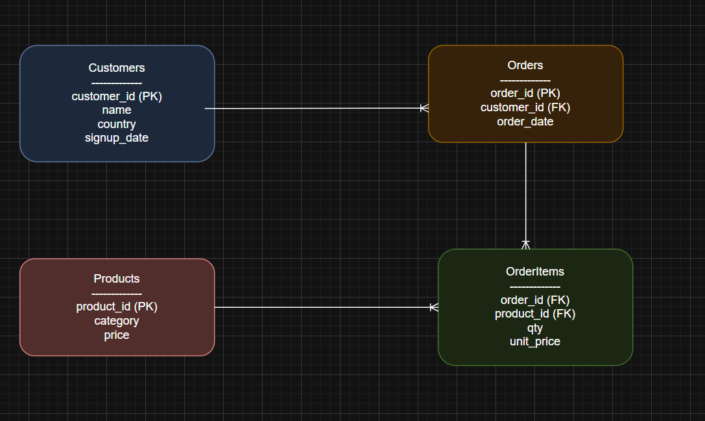
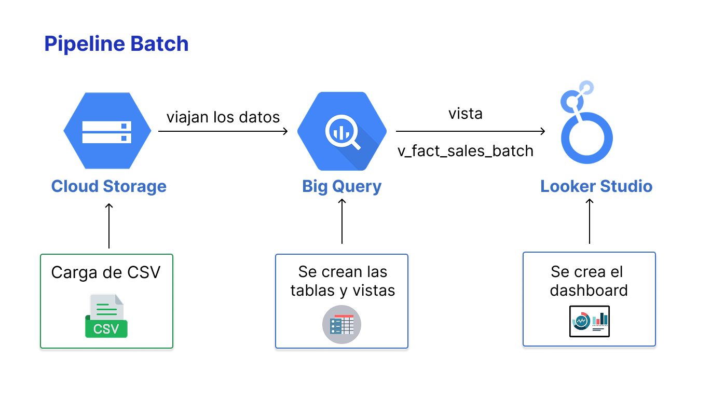
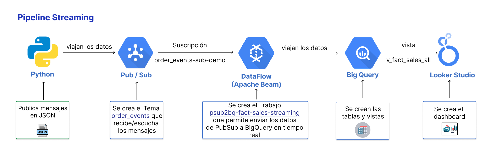
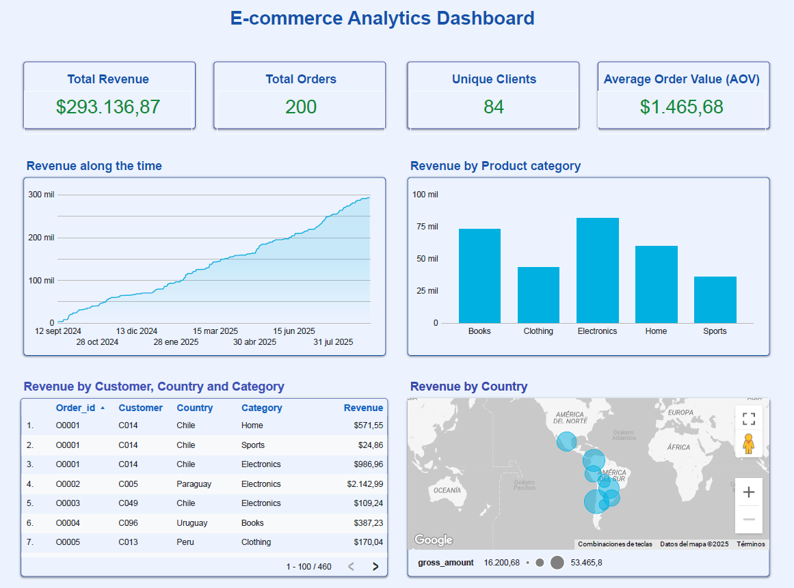

# 📌 Proyecto E-commerce Analytics (Batch + Streaming)

## 1. 🚀 Descripción del Proyecto
Este proyecto implementa una **arquitectura moderna de Analytics para E-commerce**, integrando datos históricos (batch) y datos en tiempo real (streaming).  

El objetivo es **crear dashboards en Looker Studio** que permitan analizar métricas clave del negocio:
- Ingresos (*Revenue*).  
- Órdenes totales y detalle por producto.  
- Clientes únicos y su distribución geográfica.  
- Ticket promedio (*Average Order Value - AOV*).  
- Comparativa entre batch (histórico) y streaming (tiempo real).  

---

## 2. 🛠️ Servicios de Google Cloud utilizados
| Servicio | Uso en el Proyecto |
|----------|--------------------|
|  <div align="center"></div> | **Cloud Storage**: almacenamiento de los CSV batch y los scripts Python. |
|  <div align="center"></div>  | **BigQuery**: Data Warehouse para datos históricos, vistas analíticas y unión batch + streaming. |
| <div align="center"></div> | **Pub/Sub**: Ingesta de eventos en tiempo real (órdenes simuladas). |
| <div align="center"></div>  | **DataFlow**: Pipeline de streaming que procesa los eventos y los inserta en BigQuery. |
| <div align="center"></div> | **Python**: Scripts de simulación (`publisher.py`) y pipeline. |
| <div align="center"></div> | **Looker Studio**: Dashboards interactivos para análisis. |

---

## 3. 🗂️ Modelo Entidad-Relación (ERD)

<div align="center"></div>

### Tablas principales
- **Customers**
  - `customer_id (PK)`
  - `name`
  - `country`
  - `signup_date`

- **Orders**
  - `order_id (PK)`
  - `customer_id (FK)`
  - `order_date`

- **OrderItems**
  - `order_id (FK)`
  - `product_id (FK)`
  - `qty`
  - `unit_price`

- **Products**
  - `product_id (PK)`
  - `category`
  - `price`

### Relaciones
- **Customers (1) → (N) Orders**  
- **Orders (1) → (N) OrderItems**  
- **Products (1) → (N) OrderItems**  

📌 **OrderItems es la tabla puente**: conecta órdenes con productos y permite calcular métricas como revenue.  


---
## 4. 📂 Pipelines

🔹 Pipeline Batch (ETL con BigQuery)

<div align="center"></div>

📌 Objetivo: cargar los archivos CSV históricos desde Cloud Storage a BigQuery y generar la vista de ventas históricas (v_fact_sales_batch).

Pasos:

  1 - Subimos los archivos CSV (customers.csv, orders.csv, order_items.csv, products.csv) al bucket ecommerce-demo-bucker/datasets/.
  <br>
  2 - Desde BigQuery cargamos esos archivos a tablas dentro del dataset data_ecommerce_demo.
  <br>
  3 - Creamos la vista de hechos batch:

  ```python
  CREATE OR REPLACE VIEW `data-ecommerce-demo.data_ecommerce_demo.v_fact_sales_batch` AS
  SELECT 
    o.order_id,
    TIMESTAMP(o.order_date) AS ts,  
    o.customer_id,
    oi.product_id,
    (oi.qty * oi.unit_price) AS gross_amount
  FROM `data-ecommerce-demo.data_ecommerce_demo.orders` o
  JOIN `data-ecommerce-demo.data_ecommerce_demo.order_items` oi USING (order_id);
 ```
 📌 Resultado: Vista que consolida ventas históricas con detalle de revenue por orden, cliente y producto.
 
---
 🔹 Pipeline Streaming (Pub/Sub → Dataflow → BigQuery)

 <div align="center"></div>

 📌 Objetivo: procesar órdenes simuladas en tiempo real y guardarlas en BigQuery en la tabla fact_sales_streaming.

  Componentes:
  
 - Archivo publisher.py → script en Python que publica eventos simulados en un Tema de Pub/Sub.
 - Dataflow (Apache Beam) → pipeline que lee los eventos, los transforma y los escribe en BigQuery.
  
  Ejemplo de evento publicado
```python
  {
  "event_id": "123e4567-e89b-12d3-a456-426614174000",
  "order_id": "O1234",
  "customer_id": "C054",
  "product_id": "P002",
  "qty": 2,
  "unit_price": 120.50,
  "event_ts": "2025-09-15 14:23:55"
}
```
Vista que unifica batch y streaming
```python

-- Vista que combina batch con streaming para ser utilizada en Looker Studio --

CREATE OR REPLACE VIEW `data-ecommerce-demo.data_ecommerce_demo.v_fact_sales_all` AS
-- Histórico (batch)
SELECT 
  o.order_id,
  TIMESTAMP(o.order_date) AS ts,  
  o.customer_id,
  oi.product_id,
  (oi.qty * oi.unit_price) AS gross_amount,
  'batch' AS source
FROM `data-ecommerce-demo.data_ecommerce_demo.orders` o
JOIN `data-ecommerce-demo.data_ecommerce_demo.order_items` oi USING (order_id)

UNION ALL

-- Streaming (tiempo real)
SELECT 
  order_id,
  event_ts AS ts,
  customer_id,
  product_id,
  gross_amount,
  'streaming' AS source
FROM `data-ecommerce-demo.data_ecommerce_demo.fact_sales_streaming`;

```
📌 Resultado: cada orden publicada en Pub/Sub aparece en tiempo real en BigQuery → tabla

---
## 5. 📂 Paso a Paso del Proyecto

### 🔹 1. Ingesta en Cloud Storage
Se creó el bucket **`bucket-ecommerce-octavio`** con:
- Carpeta `/datasets` → CSV históricos (customers, orders, order_items, products).  
- Carpeta `/pipelines` → scripts Python:  
  - **publisher.py** → publica eventos simulados en Pub/Sub.  

```python
import json, time, uuid, random
from google.cloud import pubsub_v1

publisher = pubsub_v1.PublisherClient()
topic_path = "projects/data-ecommerce-demo/topics/order_events"

while True:
    event = {
        "event_id": str(uuid.uuid4()),
        "order_id": f"O{random.randint(1000,9999)}",
        "customer_id": f"C{random.randint(1,100)}",
        "product_id": f"P{random.randint(1,50)}",
        "qty": random.randint(1,5),
        "unit_price": round(random.uniform(10,500),2),
        "event_ts": str(time.time())
    }
    publisher.publish(topic_path, json.dumps(event).encode("utf-8"))
    print("Published:", event)
    time.sleep(2)

```
### 🔹 2. Carga de datos en BigQuery
Se creó el dataset data_ecommerce_demo dentro del proyecto data-ecommerce-demo.
Se cargaron las tablas batch desde CSV:

- customers
- orders
- order_items
- products

Ejemplo de consultas exploratorias (batch):

```python
  -- Cantidad de clientes por país --
  SELECT country, COUNT(*) AS total_clientes
  FROM `data-ecommerce-demo.data_ecommerce_demo.customers`
  GROUP BY country
  ORDER BY total_clientes DESC;

  -- Clientes por año de registro --
  SELECT 
    EXTRACT(YEAR FROM signup_date) AS anio_registro,
    COUNT(*) AS total_clientes
  FROM `data-ecommerce-demo.data_ecommerce_demo.customers`
  GROUP BY anio_registro
  ORDER BY anio_registro;

```
### 🔹 3. Creación de vistas 
Heatmap que muestra la intensidad de ventas por día y hora:

```python
 -- Heatmap que muestra la intensidad de ventas por día y hora (Batch + streaming)
CREATE OR REPLACE VIEW `data-ecommerce-demo.data_ecommerce_demo.v_sales_heatmap` AS
SELECT 
  CASE EXTRACT(DAYOFWEEK FROM ts)
    WHEN 1 THEN 'Sunday'
    WHEN 2 THEN 'Monday'
    WHEN 3 THEN 'Tuesday'
    WHEN 4 THEN 'Wednesday'
    WHEN 5 THEN 'Thursday'
    WHEN 6 THEN 'Friday'
    WHEN 7 THEN 'Saturday'
  END AS day_name,
  EXTRACT(HOUR FROM ts) AS hour,
  SUM(gross_amount) AS revenue
FROM `data-ecommerce-demo.data_ecommerce_demo.v_fact_sales_all`
GROUP BY day_name, hour
ORDER BY day_name, hour;


```
### 🔹 4. Dashboard Batch

<div align="center"></div>
